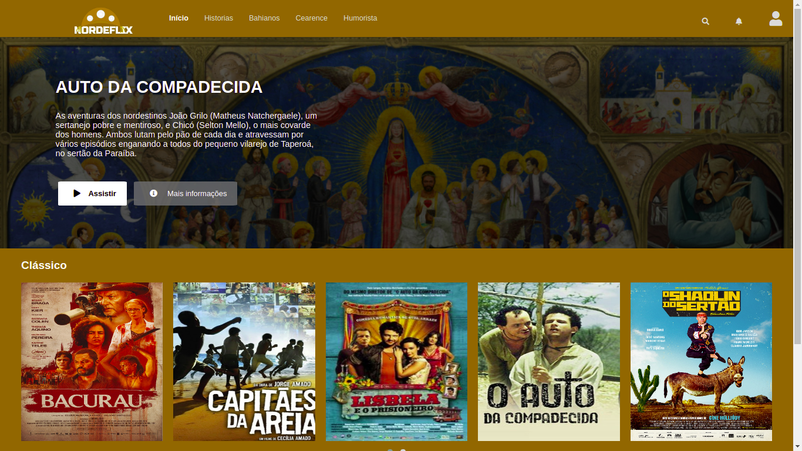
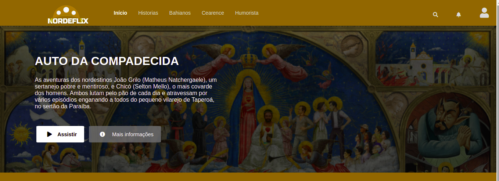
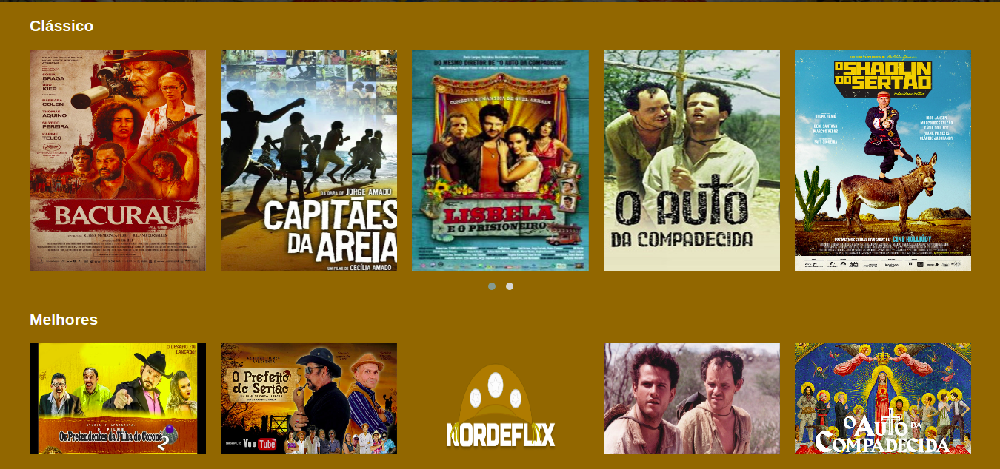

 <h1 align="center"></br>NORDEFLIX</h1></p>

<p align="center">
</img>
</p>
<p align="center">
 <table >
   <tr>
    <td>
    </td><td></td>
    <td></img></td>
   <tr>
 </table>
 </p>
<h2> :information_source: Sobre</h2>

 Uma Netflix com filmes gravados no nordeste brasileiro, dos mais famosos 
 como <b>Auto da Compadecida</b> e outros como <b>Os Pretendentes da filha do Coroné </b>, para sim os nordestino e brasil todo se divertir com os engraçados e fascinantes roteiro com divertido do mundo.
 
 
 
## :rocket: Tecnologias Utilizadas 
  - HTML
  - CSS
  - JS
  - fontawesome
  - owlcarousel2

## :books: Uso e modificações
Usei a dependencia do font-awesome
```
  $ npm install font-awesome
```
 Fora isso só é só baixar ou clonar e fazer alteração para seu aprendizado.
 

 